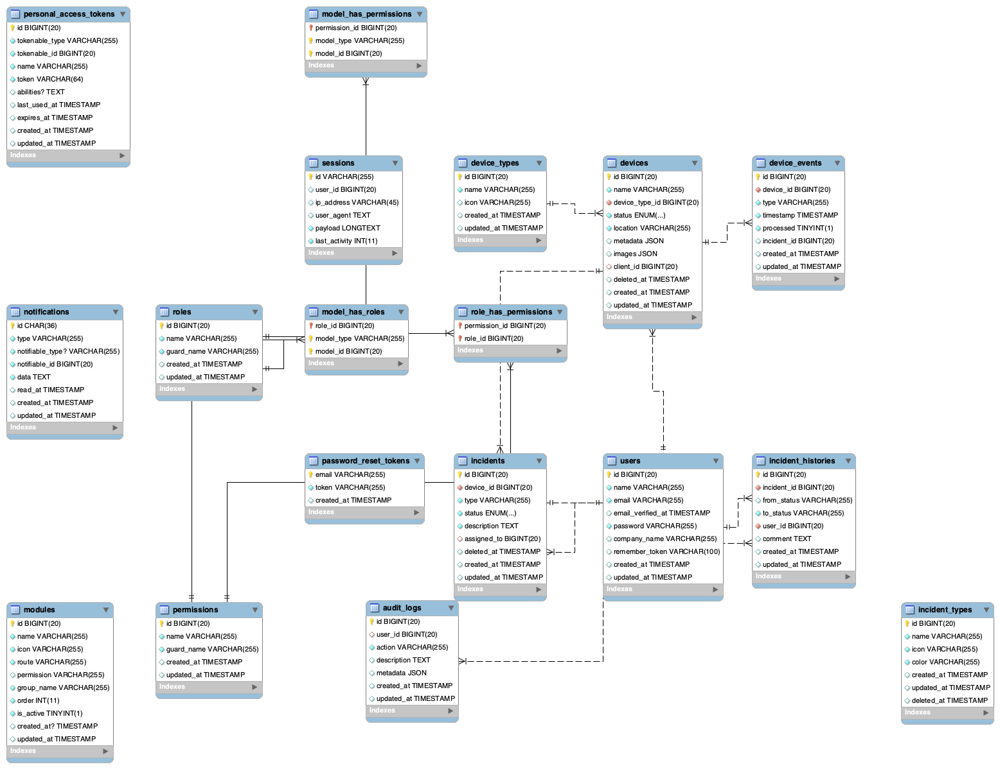

# Sistema de Seguridad — Monitoreo Táctico

[](https://laravel.com)
[](https://inertiajs.com)
[](https://tailwindcss.com)

**Sistema de Seguridad** es una plataforma de alto rendimiento diseñada para la gestión de operaciones de seguridad, respuesta ante incidencias y monitoreo de eventos críticos en tiempo real. 

---

## 📡 Simulación de Eventos Críticos (API)

El sistema integra un motor de reglas para procesar telemetría externa. Puedes inyectar una señal crítica para disparar una incidencia inmediata e impactar el estado del sensor (alerta roja) mediante el siguiente comando:

```bash
curl -X POST http://localhost:8080/api/simulate-event \
     -H "Content-Type: application/json" \
     -H "Accept: application/json" \
     -d '{
       "device_id": 1, 
       "type": "Desconexión de Red"
     }'
```

**Tipos Críticos Soportados (Activan Protocolo):**
- `Desconexión de Red`
- `Anomalía de Voltaje`
- `Alerta Térmica`
- `Actividad Sospechosa`

---

##  Instalación Rápida (Docker Sail)

El sistema está optimizado para entornos de contenedores. Sigue estos pasos para desplegar el radar operativo:

1. **Clonación del Repositorio:**
   ```bash
   git clone https://github.com/mcmenamc/sistema-seguridad.git sistema-seguridad
   cd sistema-seguridad
   ```

2. **Configuración de Entorno:**
   ```bash
   cp .env.example .env
   ```

3. **Instalación de Dependencias:**
   ```bash
   docker run --rm \
       -u "$(id -u):$(id -g)" \
       -v "$(pwd):/var/www/html" \
       -w /var/www/html \
       laravelsail/php83-composer:latest \
       composer install --ignore-platform-reqs
   ```

4. **Despliegue de Motores:**
   ```bash
   ./vendor/bin/sail up -d
   ```

5. **Aprovisionamiento de Datos (Población Táctica):**
   ```bash
   ./vendor/bin/sail artisan key:generate
   ./vendor/bin/sail artisan migrate:fresh --seed
   ```

6. **Activar Radar (Frontend):**
   ```bash
   ./vendor/bin/sail npm install
   ./vendor/bin/sail npm run dev
   ```

7. **Acceso:** [http://localhost:8080/](http://localhost:8080/)

---

## 🛠️ Decisiones Técnicas (Arquitectura)

- **Arquitectura Monolítica Modular**: Se optó por un monolito progresivo con **Laravel Inertia** para reducir la latencia en el desarrollo y despliegue, manteniendo una experiencia de usuario de Single Page Application (SPA).
- **Inertia.js + Vue 3**: Permite manejar el estado del frontend de forma reactiva sin la sobrecarga de una API REST/GraphQL desacoplada en etapas tempranas.
- **Trazabilidad Operativa (Observers)**: Todas las acciones críticas (cambios de estado, creación de reportes) son capturadas por el `IncidentObserver`, garantizando que la historia del activo sea íntegra e independiente del controlador.
- **Real-Time Engine**: Integración de eventos broadcasting para la actualización instantánea de la bitácora de incidencias sin recargar la página.

---

## 🔐 Control de Acceso Operativo (RBAC)

El sistema implementa una jerarquía de privilegios diseñada para la segregación de funciones tácticas:

| Nivel de Acceso | Privilegios y Capacidades |
| :--- | :--- |
| **Administrador** | **Control Total**: Gestión de infraestructura, registro de usuarios, configuración crítica de hardware y acceso completo a la bitácora de auditoría global. |
| **Operador** | **Gestión Táctica**: Recepción y respuesta ante incidencias, monitorización de dispositivos en tiempo real y registro de cambios operativos. |
| **Cliente** | **Monitorización Restringida**: Acceso exclusivo a la telemetría, eventos e incidencias vinculadas únicamente a sus dispositivos asignados. |

---

## Supuestos del Sistema

1. **Gestión Unificada**: Se asume que el sistema centraliza el control de diversos activos de seguridad, permitiendo una visión de 360 grados de la infraestructura técnica.
2. **Ciclo de Vida Operativo**: Se presupone una flujo de trabajo donde las incidencias son detectadas automáticamente por telemetría o registradas manualmente, para luego ser gestionadas hasta su resolución.
3. **Privacidad y Roles**: Se asume que los clientes finales solo tienen acceso a la monitorización de sus propios activos, mientras que el personal operativo gestiona la resolución de fallos globales.
4. **Escalabilidad**: El sistema está diseñado para incorporar nuevos tipos de dispositivos y protocolos de respuesta mediante la configuración dinámica de catálogos.

---

## Diagrama de Arquitectura Táctica

El siguiente diagrama ilustra la orquestación de datos y la relación entre activos, operadores y protocolos de incidencia:

<p align="center">
  
</p>

---

## Accesos de Prueba (Seeders)
*Contraseña global: `password`*

| Rol | Correo Electrónico |
| :--- | :--- |
| **Administrador** | `admin@test.com` |
| **Operador** | `carlos.ops@test.com` |
| **Cliente** | `juan.perez@test.com` |

---
*Desarrollado con precisión técnica por EL ING. JESUS ANTONIO MENA DE LA ROSA.*
